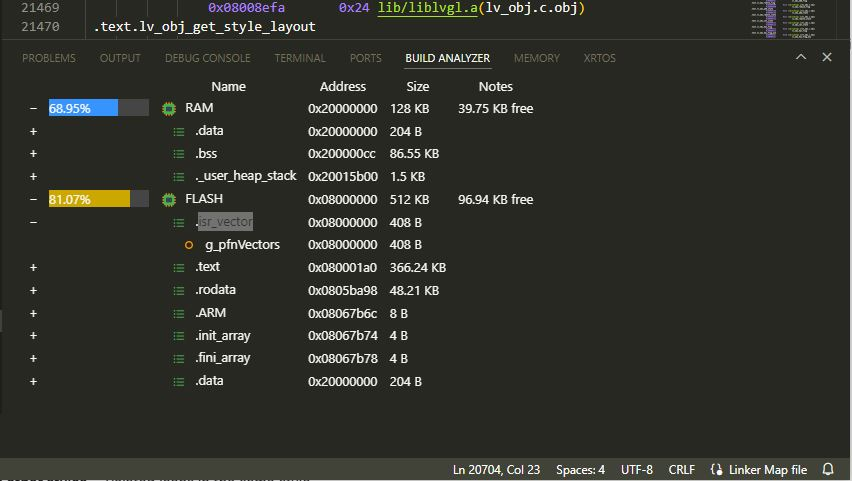

# STM32 Build Analyzer

## Overview

This is my first attempt to make my own plugin for VSCode

## Features

* Custom bottom-panel webview.
* Memory region analysis from .map files.
* Displays detailed memory usage, including sections and their sizes.
* Compatible with any STM32-based project.
* Symbols have links to source code.

### 1.0.0

Initial STM32 Build Analyzer plugin release

### 1.0.2

Added icons and indents

### 1.0.3

- arm-none-eabi-objdump and arm-none-eabi-nm are used to get more accurate results
- symbols now have links to source code

### 1.0.4
- fixed a bug causing incorrect operations with sectors at address 0x00000000 (e.g., ITCMRAM)

### 1.0.5
- the plugin worked only with the 'Debug' build type - fixed. now the plugin gets the build type name from the CMake Tools extension

## License

This extension is licensed under the [MIT License](LICENSE).